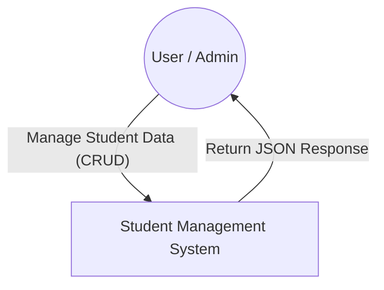

# 🏛️ Architecture Design Document  
**Student Management System**

---

## 1. Context Diagram (C1)
แสดงภาพรวมการทำงานของระบบ **Student Management System** และผู้ใช้งานภายนอก


## 2. Container Diagram (Layered Architecture)
โครงสร้างภายในของระบบ แบ่งออกเป็น 3 Layers หลัก (3-Tier Layered Architecture)
```graph TD
    subgraph "Presentation Layer"
        Routes[Routes]
        Controllers[Controllers]
    end

    subgraph "Business Layer"
        Services[Services]
        Validators[Validators]
    end

    subgraph "Data Layer"
        Repositories[Repositories]
        Database[(SQLite Database)]
    end

    Routes --> Controllers
    Controllers --> Services
    Services --> Validators
    Services --> Repositories
    Repositories --> Database
```
3. Layer Responsibilities
🟢 Layer 1: Presentation Layer

ตำแหน่ง: src/presentation/

หน้าที่:
เป็นจุดรับ HTTP Request จากผู้ใช้ และส่ง HTTP Response กลับไป

Components:

Routes:
กำหนด Endpoint URL เช่น /api/students

Controllers:
รับ Input จาก Request, เรียกใช้ Service และจัดการ Error (try-catch)

Middlewares:
จัดการ Error กลาง (Global Error Handler)

🔵 Layer 2: Business Layer

ตำแหน่ง: src/business/

หน้าที่:
จัดการ Business Logic และกฎเกณฑ์ของระบบ

Components:

Services:
ประมวลผลตาม Business Rules
(เช่น ห้ามลบนักศึกษาที่มีสถานะ Active)

Validators:
ตรวจสอบความถูกต้องของข้อมูล (Validation)
เช่น รูปแบบรหัสนักศึกษา หรือข้อมูลที่จำเป็น

🟠 Layer 3: Data Layer

ตำแหน่ง: src/data/

หน้าที่:
จัดการการเชื่อมต่อฐานข้อมูลและคำสั่ง SQL

Components:

Repositories:
รวมฟังก์ชัน CRUD (Create, Read, Update, Delete)
ไม่เกี่ยวข้องกับ Business Logic

Database Connection:
เชื่อมต่อกับไฟล์ students.db (SQLite)

4. Data Flow Scenario
ตัวอย่าง: เพิ่มนักศึกษาใหม่

Endpoint: POST /api/students

Flow การทำงาน:

Request:
User ส่ง JSON Data มาที่ Route /api/students

Presentation Layer:
StudentController รับข้อมูลจาก req.body

Business Layer:
StudentService เรียก StudentValidator
เพื่อตรวจสอบความถูกต้อง (Format, Required Fields)

Data Layer:
เมื่อข้อมูลผ่านการตรวจสอบ
StudentService ส่งข้อมูลไปที่ StudentRepository
เพื่อทำการ INSERT ลง Database

Response:
Database ส่ง ID ที่สร้างใหม่กลับมา
→ ส่งย้อนขึ้นตามลำดับ Layer
→ Controller ตอบกลับ User ด้วย
HTTP 201 Created

✅ Architecture Summary

ใช้ Layered Architecture (3-Tier)

แยกความรับผิดชอบชัดเจน

ง่ายต่อการดูแล แก้ไข และทดสอบ

รองรับการขยายระบบในอนาคต